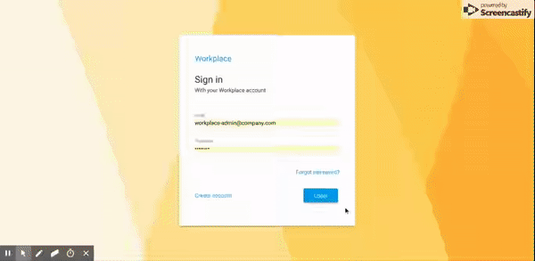

# Workplace

Time sheet application for organizations.

Created with [Loopback](https://loopback.io/doc/en/lb3/), [Angular](https://v6.angular.io) and [Angular Material](https://v6.material.angular.io/)

UI for this project is compiled from repository: [Workplace UI](https://github.com/harishanchu/workplace-ui)

## Installation

#### Method 1 (With docker and docker-compose)

- Clone the repository.
- Modify [configuration](#configuration) files in the repository directory as needed.
- Open terminal in the repository directory and run command `docker-compose up -d mysql adminer`.
- Navigate to `http://localhost:8085/?server=mysql&username=root` in your browser.
- Login by providing password as `password`.
- Create a database named `workplace`.
- Head back to terminal and run command `docker-compose up`.

#### Method 2 (Run directly on your workstation)

- Install NodeJs(version >=8).
- Install and start mysql(version >= 5.7.21) server.
- Create a database table `workplace`
- Clone this repository.
- Modify [configuration](#configuration) files in the repository directory as needed(modify db host address, smtp configuration etc).
- Install dependencies by running command `npm install --production`.
- Run the application with command `npm run start-production`.

After installation application can be accessed with url: `http://localhost:3000`.

When you start the application for the first time a default admin user is created with email: `workplace-admin@company.com` and password `password`.
Default admin user email can be set in the [configuration](#configuration) files and password is read from the environment variable `WORKPLACE_ADMIN_PASSWORD`.

Note: Admin user is only created once when you start the application for the first time, once you have an admin user created, changing admin email in te configuration files will not have any effect.

Admin users will have admin functionality enabled in the app.

## Configuration

- Application general configuration files can be found in `config` directory.
- Database and email connectivity configuration file is in path `server/datasources.json`

## Conventions

- When a time sheet is created an associated task is created for the time sheet.
- Open tasks can be linked to new time sheets by using the link button from the top right corner of time sheet entry popup.
- When a time sheet is marked as completed the associated task will be marked as closed.

## To do

- Employee clock in/out.
